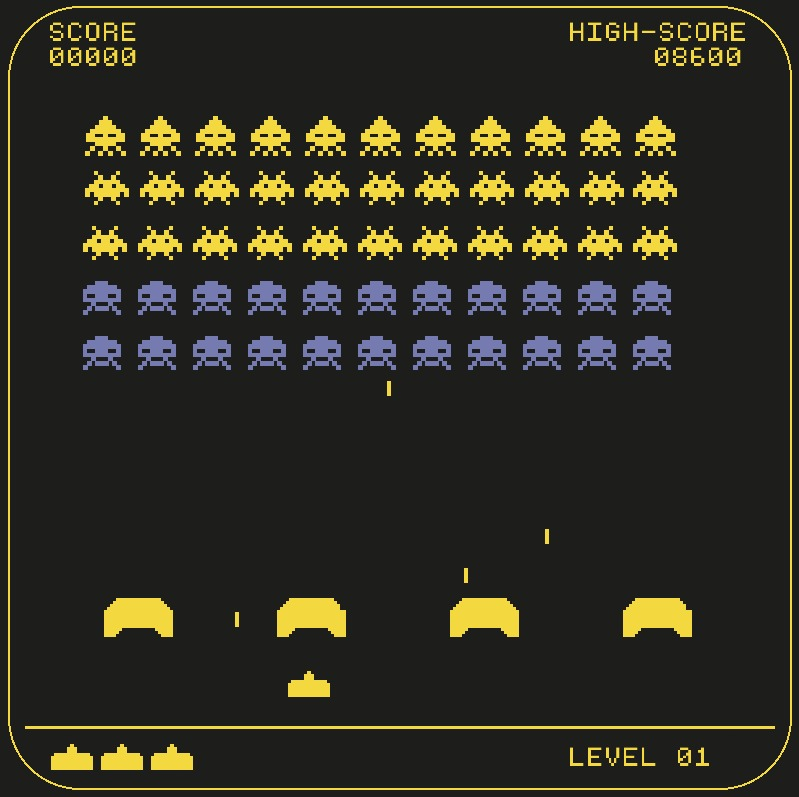
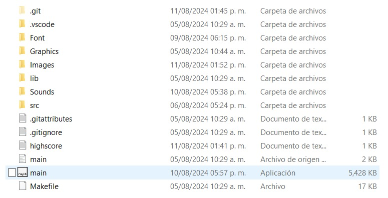
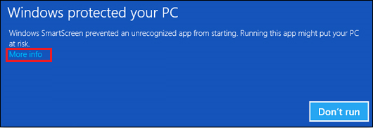

# About
Space Invaders is an all-time classic game in which you have to destroy all the aliens that are coming to you, before they destroy you! The purpose of this project was to
learn advanced OOP concepts and improve in C++ programming by learning concepts like vectors and iterators.

  

## Requirements
Fortunately, there is no pre-requisite in order to run this game! In short, you'll learn how to run it on your computer...

## Running the game
- Download the source code and decompress it on a folder.
- Open the executable file called "main".
- Use the left and right arrows to move the spaceship around, shoot lasers with the spacebar, and restart with 'enter'.
- Have fun!

  

## Warning
It might appear a message that says "Windows protected your computer". In that case, just select "More info" and then "Run anyway" :).

  

